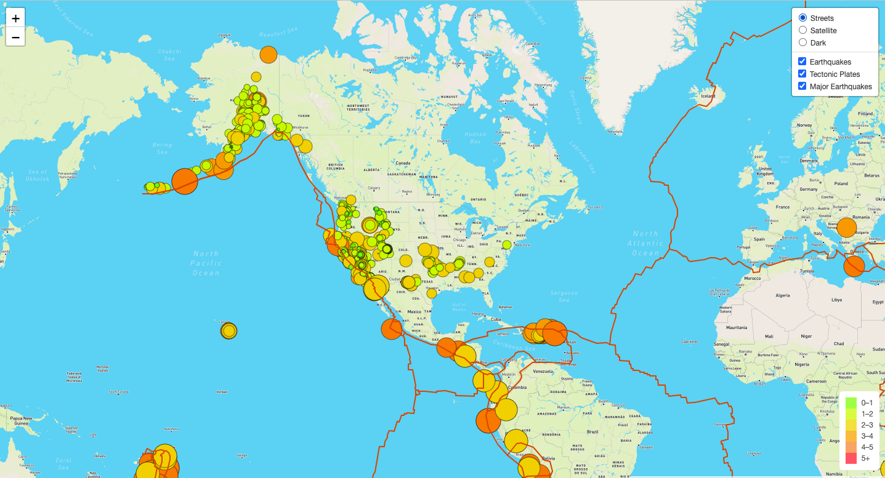
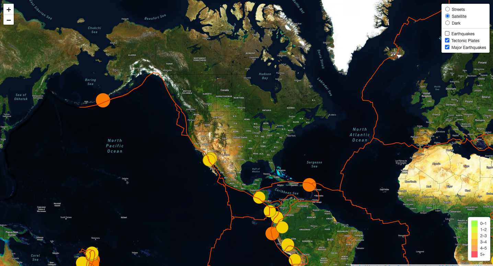

# Mapping Earthquakes

[HTML Link](https://github.com/c-geisel/Mapping_Earthquakes/blob/main/Earthquake_Challenge/index.html) | [Javascript Link](https://github.com/c-geisel/Mapping_Earthquakes/blob/main/Earthquake_Challenge/static/js/challenge_logic.js)

## Purpose 
The purpose of this project is to create interactive data visualizations on earthquakes around the world. To do this, GeoJSON data is used alongside APIs, JavaScript, and the D3 and Leaflet libraries. To display the desired information, circle markers are used that are sized and colored in various ways to display the magnitude and location of earthquakes around the world in the past 7 days. Layer options are also added to toggle all earthquakes data, major earthquake data, and tectonic plate lines. 

## Results 
In the image below, the web page with earthquake visualizations is shown. All earthquake and tectonic plate information is being shown. There are 3 style options for the background map, and here the "Streets" style is used.

In the following image, the earthquake data is toggled off to show just the tectonic plate lines and the major earthquake data. The style of the map has also been changed to "Satellite"

